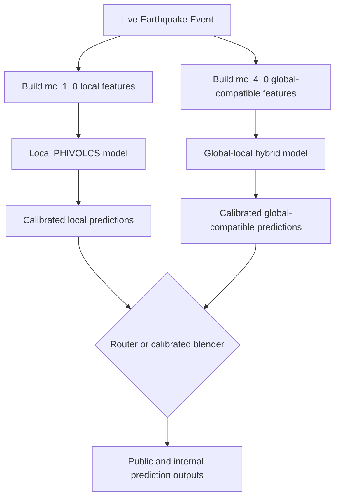

# Reference: Improving Extreme Earthquake Prediction through Global-Local Hybrid Learning

Status: research proposal and modeling reference. This document describes a
recommended direction for improving SEIS on rare, high-magnitude earthquake
sequences. It should not be read as a validated production design until the
validation checklist near the end has been completed.

The current local model is strong on common aftershock-pattern prediction, but
large initiating earthquakes are rare in the Philippine-only training set. The
goal of this roadmap is to improve high-magnitude sequence modeling while
preserving the existing Philippine-local performance.

---

# 1. Current Repo Baseline

The current `mc_1_0` training table is:

```text
src/training_set/training_dataset_mc_1_0.csv
```

It contains 124,047 events. The rare-event support is thin:

| Magnitude | Number of Events |
| --------- | ---------------: |
| >= 4.0    |            4,888 |
| >= 5.0    |              632 |
| >= 6.0    |               82 |
| >= 7.0    |                8 |

The largest local training event is M7.4. An M7.8 event is therefore outside the
observed local training magnitude range.

The current classification target schema is no longer the old independent
distance-bin setup. It is a single multiclass spatial target:

```text
aftershock_spatial_zone_24h
```

The served probabilities are derived from that one model:

```text
aftershock_24h
aftershock_within_10km_24h
aftershock_within_25km_24h
aftershock_within_50km_24h
aftershock_beyond_50km_24h
```

This is important because it avoids incoherent independent distance probabilities
and preserves a cleaner probability structure for public-facing outputs.

The current regression targets are:

```text
max_aftershock_mag_24h
nearest_aftershock_distance_km_24h
median_aftershock_distance_km_24h
p90_aftershock_distance_km_24h
```

The feature set already includes several physically motivated or normalized
features:

```text
rupture_depth_attenuation
seis_traffic_ratio_30d
baths_law_limit
local_b_value_50km_3y
```

`baths_law_limit` is currently computed as `event_magnitude - 1.2`. It should be
interpreted as a current-event Bath's Law proxy, not as a true mainshock feature,
because a live event is not guaranteed to be the final mainshock of its sequence.

---

# 2. Problem Statement: Rare Extreme Events

During a live prediction run on the June 8, 2026 Sarangani earthquake sequence,
the current ensemble showed a major failure on the expected maximum aftershock
for the initiating large event.

The run was operator-observed during live use. There is no saved prediction JSON
artifact for this specific run, so it should be treated as legitimate primary
operator evidence, but not as a fully reproducible benchmark until the same case
is rerun and saved.

| Event           | Predicted Maximum Aftershock | Observed Maximum Aftershock |
| --------------- | ---------------------------: | --------------------------: |
| M7.8 Mainshock  |                         4.31 |                         6.4 |
| M4.1 Aftershock |                         5.70 |                         5.5 |

The contrast is informative:

- The M7.8 initiating event was larger than anything in local training data, and
  recent-history features were sparse because it started the sequence.
- The later M4.1 aftershock had the M7.8 event in its history window, so recent
  counts, local energy, parent/eta context, and nearest-recent-event features
  became highly informative.

This suggests the model is better at recognizing the consequences of a major
event after it has already happened than estimating sequence productivity from
the initiating high-magnitude event itself.

---

# 3. Core Limitations

## A. Extreme Event Scarcity

Only eight local training events are M7.0 or larger. That is not enough support
for supervised learning to robustly learn M7+ aftershock productivity, especially
for events above the local maximum magnitude.

This affects:

- maximum expected aftershock magnitude
- probability of damaging aftershocks
- aftershock count or productivity
- wide-area spatial spread of the sequence

## B. Tree-Ensemble Extrapolation Limits

The current ensemble is built from tree-based model families such as XGBoost,
LightGBM, CatBoost, and Random Forest.

Tree ensembles can model nonlinear structure inside the observed training
support, but they do not extrapolate smoothly beyond the maximum observed
magnitude. Once a sample reaches the largest learned magnitude split, larger
events can fall into the same terminal leaves as merely "large" but still
in-distribution events. The prediction then reflects the training targets inside
those leaves, not a physically extrapolated rupture-productivity curve.

This makes underprediction of M7.8/M8-class sequence severity plausible. However,
it should be reported as a tested failure mode only after stratified holdout
analysis by initiating-event magnitude.

## C. History Proxy Dependence

The current feature set is intentionally backward-looking and leakage-safe. That
is correct for deployment, but it means a first large event in a sequence may
have relatively little local-history signal.

After the first major event occurs, subsequent events can benefit from strong
history proxies:

- recent large parent or nearby event
- elevated local event counts
- elevated local cumulative energy
- stronger parent/eta context
- shorter nearest-recent-event age

This is useful for aftershock monitoring, but insufficient for estimating the
productivity of the initial large event.

## D. Aggregate Metrics Hide Tail Risk

The 2026 holdout metrics are useful for deployment-style evaluation, but aggregate
MAE, RMSE, R2, ROC-AUC, and average precision can hide failures on rare M7+
events. Extreme-event evaluation needs explicit stratification by magnitude and
sequence type.

---

# 4. Motivation for Global Training Data

The rarity of large Philippine earthquakes fundamentally limits local-only
supervised learning. Carefully selected global earthquake catalogs can increase
the number of M7+ and M8+ initiating events available for training.

The motivation is strongest for targets tied to sequence severity:

- `max_aftershock_mag_24h`
- future `max_aftershock_mag_72h`
- future `aftershock_count_24h` / `aftershock_count_72h`
- future `m5_plus_aftershock_24h`
- future `stronger_aftershock_24h`

Empirical laws such as Omori's Law, Gutenberg-Richter scaling, and Bath's Law are
observed broadly, but regional behavior still matters. Global data should improve
rare-event support, not erase Philippine-local calibration.

---

# 5. Catalog Completeness Problem

The PHIVOLCS-derived local catalog supports an `mc_1_0` modeling path with many
small earthquakes. A global catalog such as USGS is usually not comparable at
that same low magnitude threshold across all regions and time periods.

Naively merging PHIVOLCS M1+ data with global M4+ data would distort:

- rolling event counts
- local event rates
- cumulative energy summaries
- local b-value estimates
- nearest-recent-event features

The global-compatible feature path should therefore impose an explicit magnitude
completeness threshold. M4.0 is a reasonable starting hypothesis, not a universal
truth. Completeness should be estimated or documented per catalog, region, and
time range whenever possible.

---

# 6. Recommended Architecture

Use a dual-model research architecture first. Do not immediately ship a hard
production route at `M_input >= 4.0` until validation proves it improves
Philippine holdout behavior.



Recommended serving behavior:

- Keep the local `mc_1_0` model for small and common events.
- Add a global-compatible `mc_4_0` model for large-event sequence severity.
- Compare hard routing, soft blending, and magnitude-dependent weighting.
- Avoid a discontinuous public behavior cliff around M4.0 unless it is clearly
  validated.
- Keep output calibration separate for each model path.

The simplest first experiment is:

```text
if magnitude >= 4.0:
    compare local mc_1_0 output vs global-compatible mc_4_0 output
else:
    use local mc_1_0 output
```

But the production decision should be based on Philippine holdout performance,
not the threshold alone.

---

# 7. Regional Tectonic Filtering

Training data should prioritize tectonic settings comparable to the Philippines,
especially subduction and island-arc environments.

Candidate regions:

- Japan
- Sumatra
- Mariana
- Kuril-Kamchatka
- Tonga
- Chile
- other well-instrumented subduction-zone catalogs with clear metadata

Avoid making exclusion rules too absolute. Continental transform and intraplate
regions may be poor matches, but the better approach is to include tectonic
metadata and run ablation studies:

- subduction-only global model
- all-global model with region metadata
- Philippines-only model
- global pretrain plus Philippine fine-tune
- weighted global-local joint model

The production model should choose the approach that improves Philippine
deployment metrics, not the approach that seems geologically intuitive upfront.

---

# 8. Target Strategy

The global-local work should preserve the current multiclass spatial-zone target:

```text
aftershock_spatial_zone_24h
```

This keeps public distance probabilities coherent.

For massive-earthquake awareness, add targets that directly encode severity and
sequence productivity:

## Tier 1 Targets

```text
aftershock_count_24h
aftershock_count_72h
max_aftershock_mag_24h
max_aftershock_mag_72h
m5_plus_aftershock_24h
m5_plus_aftershock_72h
```

These are more operationally meaningful than broad radius containment.

## Tier 2 Targets

```text
stronger_aftershock_24h
stronger_aftershock_72h
time_to_first_aftershock_if_any
nearest_aftershock_distance_band_if_any
```

`stronger_aftershock_*` is especially important for public risk communication,
but it will be rare and must be framed as relative risk, not a deterministic
alarm.

## Modeling Notes

- Count targets should use count-aware objectives where possible, such as
  Poisson, Tweedie, or `log1p(count)` regression.
- Magnitude escalation targets should be calibrated classifiers, not thresholds
  inferred from a weak regressor alone.
- Regression outputs should include uncertainty or prediction intervals for
  public use.

---

# 9. Feature Engineering Improvements

Some features already exist and should be preserved:

```text
rupture_depth_attenuation
seis_traffic_ratio_30d
baths_law_limit
local_b_value_50km_3y
```

Recommended refinements:

- Rename or document `baths_law_limit` as a current-event proxy, because it is
  computed from the live event magnitude, not confirmed mainshock magnitude.
- Add cumulative seismic moment features over recent windows.
- Add maximum recent magnitude over wider spatial windows for the `mc_4_0` path.
- Add sequence-age features only when a sequence-initiation rule is explicitly
  defined without leakage.
- Add Omori-style decay features only if the triggering event and elapsed time
  are defined causally from prior events.
- Consider slab depth, trench distance, tectonic regime, and focal mechanism
  where available.

Feature definitions must remain identical between training and serving for each
model path. If there is an `mc_1_0` and `mc_4_0` path, each path needs its own
saved feature manifest and reproducibility checks.

---

# 10. Proposed Training Strategy

## Stage 1: Build a Global-Compatible Catalog

Collect global earthquake sequences from selected tectonic regions. Normalize the
schema to the same core fields used by the local pipeline:

```text
origin_time
latitude
longitude
depth_km
magnitude
catalog_source
tectonic_region
```

Apply a documented completeness threshold, initially `mc_4_0`.

## Stage 2: Rebuild Sequence Labels

Do not import foreign catalog labels directly unless they are produced with a
compatible definition. Recompute sequence targets with a consistent forward-window
labeling method wherever possible.

The global labels should align with the current SEIS target contract:

```text
aftershock_spatial_zone_24h
aftershock_24h
max_aftershock_mag_24h
nearest/median/p90_aftershock_distance_km_24h
```

Then extend the target set with count and escalation labels.

## Stage 3: Train Candidate Models

Train and compare:

- local-only `mc_1_0`
- local-only `mc_4_0`
- global-only `mc_4_0`
- global + local joint `mc_4_0`
- global pretrain with Philippine fine-tuning
- global + local with Philippine sample weighting

Train classification, count, and regression targets. Do not limit this work to
the magnitude regressor.

## Stage 4: Evaluate on Philippine Events Only

Evaluation should be deployment-aligned:

- Philippine temporal holdout only
- no Sarangani tuning if Sarangani is used as a final stress test
- metrics stratified by input magnitude bucket
- metrics stratified by whether the event is an initiating event or already has
  recent large-event history
- calibration curves for public probability outputs
- separate reporting for common-event performance and M6+/M7+ tail behavior

---

# 11. Required Validation Checklist

Before treating this roadmap as a production model design, complete:

1. Rerun and save the Sarangani prediction input and output JSON.
2. Add a stress-test folder for handpicked major Philippine sequences.
3. Report metrics for `M < 4`, `M4-M5`, `M5-M6`, `M6-M7`, and `M >= 7`.
4. Compare local `mc_1_0` vs local/global `mc_4_0` on the same Philippine holdout.
5. Check whether global data improves `max_aftershock_mag_*` without degrading
   `aftershock_24h` calibration.
6. Evaluate count and M5+ escalation targets, not only magnitude regression.
7. Verify that no future cluster labels or post-event sequence features leak into
   serving features.
8. Save model artifacts, feature manifests, commands, and prediction outputs for
   every stress-test case.

---

# 12. Expected Benefits

If validated, the global-local framework should:

- improve rare M7+ sequence severity prediction
- reduce high-magnitude underprediction from local-only tree models
- improve damaging-aftershock awareness through count and M5+ targets
- preserve local performance on common Philippine earthquakes
- keep public probability outputs coherent through the spatial-zone classifier
- make extreme-event outputs easier to audit through saved stress-test artifacts

---

# Future Work

Potential extensions:

- focal mechanism and moment tensor features
- tectonic descriptors such as slab depth and trench distance
- uncertainty intervals for maximum magnitude and count targets
- conformal prediction or quantile regression for public-facing ranges
- physics-guided ML that combines empirical seismic laws with statistical
  learning
- explicit model cards for disaster-awareness deployment limitations
